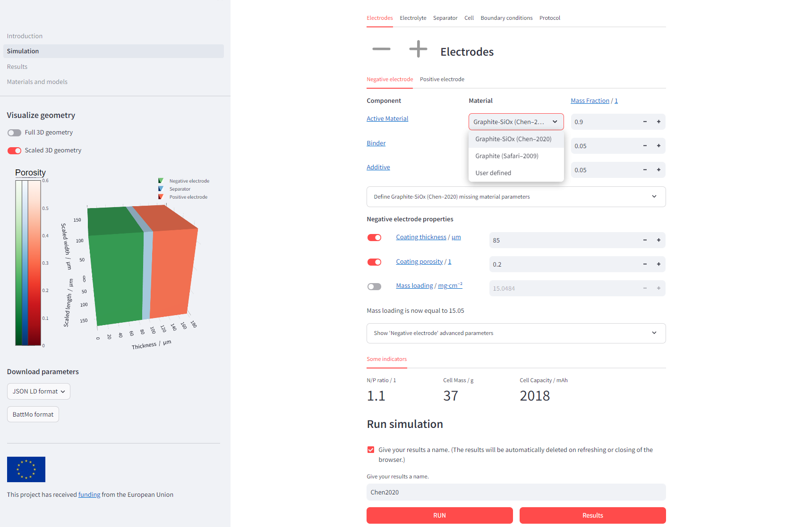

# Summary

BattMoApp is a web-based application built upon the command-line based battery modelling software, BattMo. It features a user-friendly graphical interface that simplifies the simulation of battery cells. The development of BattMoApp has been centered on accessibility, intuitiveness, and usability, with the aim of making it a practical and valuable tool for both educational and research purposes in the battery field. Its design allows users to simulate, obtain, analyze, and compare results within just a few minutes. While BattMoApp leverages a small yet crucial portion of BattMo's capabilities, its intuitive and explanatory design also makes it an ideal starting point for those looking to explore the more comprehensive and complex BattMo software.

# Statement of need

The Battery Modelling Toolbox (BattMo) is a framework for continuum modeling of electrochemical devices. Built primarily in Matlab, it offers a pseudo X-dimensional (PXD) framework for the Doyle-Fuller-Newman model of lithium-ion battery cells. Additionally, extensions for other battery chemistries and hydrogen systems are in development. BattMo provides a flexible framework for creating fully coupled electrochemical-thermal simulations of electrochemical devices using 1D, 2D, or 3D geometries. Besides the Matlab toolbox, the framework is also being developed in Julia to leverage increased simulation speed and the non-proprietary nature of Julia.

The primary objective of BattMoApp is to unlock access to battery simulations for users without coding experience. Most researchers who can benefit from battery simulations are not familier with any scripting language. A simple to use graphical user interface brings battery simulations to laboratory engineers and battery scientists who can use the results to inform their cell design and development activities.

BattMoApp builds upon the P2D model implemented in the Julia version of BattMo. The development of BattMoApp has focused on accessibility, intuitiveness, and usability. Users can quickly and easily obtain results using the default input parameter sets available in the application or input their own values in a straightforward manner. The results can be easily analyzed and compared using the predefined plots that can handle multiple sets of simulation results. Users can also download their results and later upload them back into the application to review. Furthermore, significant effort has been made to ensure the parameters are realistic for both computational research and lab use, making it easier for experimentalists to fulfill the necessary inputs.

Another important aspect, besides accessibility, intuitiveness, and usability, is interoperability. To ensure that the input data of the simulation is inter-operable, the selected data format adheres to the FAIR principles and the 5-star open data guidelines. The data entered by the user is automatically formatted into a JSON Linked Data (LD) format which includes all the semantic metadata along with the actual data. This semantic data connects the actual data to the ontology documentations, EMMO and BattINFO, which contain descriptions of the linked data definitions. With this, the JSON LD format eliminates any confusion about definitions. If the user wishes to publish their results, they can include the JSON LD file in their publication, allowing anyone seeking to replicate the results to simply upload the JSON LD file into BattMoApp and obtain the anticipated results.

The documentation of BattMoApp includes an overview on what the application has to offer and a troubleshooting section that provides insights into the relationship between input parameters and results. As BattMoApp is designed to be informative and explanatory, it can also be a powerful tool for educational purposes, helping students understand batteries, battery modelling, and the impact of material and cell design parameters on battery cell performance.

# Technical setup

The application consists of two main components: the graphical user interface (GUI), which includes the frontend, a database, and the backend that provides the frontend's functionality, and the application programming interface (API) that runs the BattMo software in the background. These two components are isolated from each other, each running in its own Docker container.

### BattMo GUI

The frontend is Python-based and developed using the Streamlit framework. Streamlit was chosen due to its user-friendly framework, which greatly accelerates the development process. The backend, also written in Python, supports the frontend's functionality. The database that supports both the frontend and backend is created using the sqlite3 Python package.

### BattMo API

The API runs the Julia package BattMo. Integrating Julia, a pre-compiled language, with Python, a runtime language, to form a smoothly running and stable application turned out to be complex. Therefore, a Julia-based API was created and containerized within a separate Docker container, isolating it from the BattMo GUI. This separation ensures that the Julia and Python components do not interfere with each other. The framework used for creating the API is Genie. Within the BattMo API's docker image a system image of BattMo's pre-compilation is created to ensure an instantanious API response.

# Examples

The application provides a list of features:

\begin{itemize}
\item Access to parameter sets from literature, and costomization of these sets.
\item Download input parameter values as a BattMo formatted JSON file or as a linked data formatted JSON file.
\item Visualization of 3D grids.
\item P2D model.
\item Quick calculations of key indicators.
\item Interactive plots that zoom, hover, and downloads PNGs.
\item Visualization of not only voltage curves but also internal states to provide further insight into gradients of concentrations and potentials.
\item Comparison of multiple simulation results.
\item Download full results as HDF5.
\end{itemize}

The following figures display screenshots of the application's 'Simulation' and 'Results' pages. On the 'Simulation' page, users can define input parameters, visualize their cell geometry, and initiate a simulation. The 'Results' page then allows for the visualization of simulation outcomes using predefined plots. In \autoref{fig:results}, the results of two simulations are visualized to show an example. The two simulations were conducted using the default parameter sets from Chen et al., with the electrode coating thicknesses varied to illustrate a comparison of results. Both pages also present key indicators of the battery cell, such as capacities, cell energy, and round-trip efficiency.

<!-- ne_think = 150
pe_thick = 130 -->

# Future work

While BattMoApp has reached a mature state and offers a valuable platform for P2D simulations, there are still countless possibilities for further development. Its evolution will continue in parallel with BattMo.jl, allowing for the future integration of additional simulation models and features like parameterization. BattMoApp will continue seeking feedback from its target audience to enhance usability and practicality. Additionally, more effort will be dedicated to improving the performance BattMo GUI to improve user interactivity.

# Installation and contribution

`BattMoApp` can easily be used online at the following address: app.batterymodel.com. Furthermore, it can be locally installed using Docker. The Docker images and a detailed instruction on how to install `BattMoApp` locally can be found in the Github repository.

# Acknowledgements

BattMo has received funding from the European Union's Horizon 2020 innovation program under grant agreement numbers:

- 875527 HYDRA
- 957189 BIG-MAP

# References